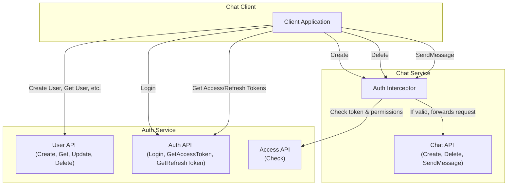

# Chat Micro-services (Auth & Chat)

A gRPC backend split into two independent Go services:

1.  **auth** – user registration / authentication
2.  **chat_server** – chat rooms & messaging

Each service owns its own PostgreSQL database and is exposed via gRPC with protobuf contracts located under `*/api/*/*.proto`.

## Architecture

The following diagram illustrates the communication flow between the services:



## Tech Stack

- Go 1.24
- gRPC + Protocol Buffers
- PostgreSQL
- `goose` for SQL migrations (invoked via Makefiles)
- Docker & Docker Compose (local databases)
- Makefile driven developer workflow

## Quick Start (Docker Compose via Make)

### 0. Prerequisites

* Docker + Docker Compose
* Make

### 1. Clone & enter the repo

```bash
git clone git@github.com:<you>/chat.git
cd chat
```

### 2. Bring everything up

```bash
make compose-up
```

When it finishes you should have:

* Auth gRPC: `localhost:50051`
* Auth REST/HTTP: `http://localhost:8081`
* Chat gRPC: `localhost:50052`
* Prometheus: `http://localhost:9090`
* Grafana: `http://localhost:3000` (admin/admin)

### 3. Tear everything down

```bash
make compose-down
```

## Project Structure (simplified)

```
|-- auth/
|   |-- cmd/server          # main entry-point
|   |-- api/user_v1/*.proto # gRPC contract
|   |-- internal/...        # handlers, services, repo, etc.
|   |-- migrations/*.sql    # goose migrations
|
|-- chat_server/            # same layout for chat
|
|-- docker-compose.yaml     # two Postgres instances
|-- Makefile                # root-level helper targets
```

## Trying the APIs

Generate gRPC stubs in your preferred language from the `.proto` files or use `grpcurl`, e.g.:

```